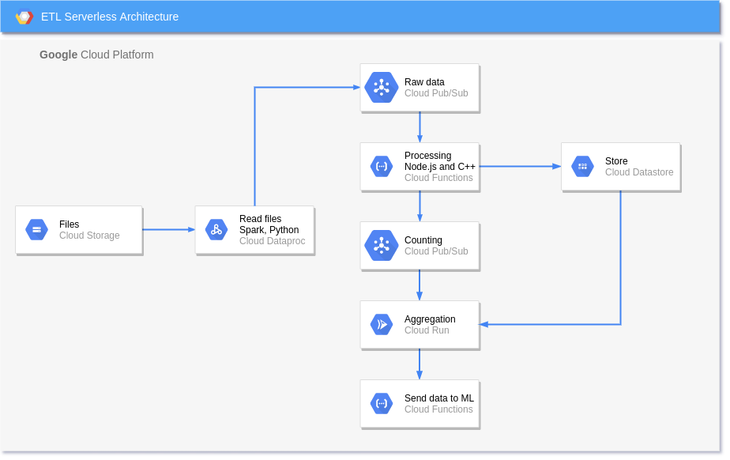

# Serverless BigData ETL



We need
- read text files from a folder
- send each line to the message queue
- process each message with C++ and write result to the database
- publish a new message for each file when all lines of a file will be written to the database
- read data from database and send to the Neural Network

We'll use
- Google Cloud Storage (GCS)
- Google DataProc (Apache Spark)
- Google Cloud Functions
- Google Compute Engine
- Google PubSub
- Google Datastore
- Python
- Node.js
- C++


## Step 1

1. Create a bucket `dataproc-cluster` on GCS
2. Upload `pip-install.sh` and `producer.py`
3. Upload text files to the folder `data`

## Step 2
Create a DataProc cluster (Apache Spark)

```shell
gcloud beta dataproc clusters create \
cluster-test \
--enable-component-gateway \
--bucket dataproc-cluster-test \
--region europe-west1 \
--subnet default \
--zone "" \
--master-machine-type n1-highmem-4 \
--master-boot-disk-size 500 \
--num-workers 3 \
--worker-machine-type n1-highmem-4 \
--worker-boot-disk-size 500 \
--image-version 1.3-deb9 \
--optional-components ANACONDA,JUPYTER \
--scopes 'https://www.googleapis.com/auth/cloud-platform' \
--tags dataproc \
--project pq-stream \
--initialization-actions 'gs://dataproc-cluster/pip-install.sh' \
--metadata 'PIP_PACKAGES=google-cloud-pubsub==0.42.1' \
--properties 'spark:spark.driver.extraJavaOptions=-Xss4M,spark:spark.executor.extraJavaOptions=-Xss4M,spark:spark.driver.memory=20g,spark:spark.driver.maxResultSize=16g,spark:spark.task.maxFailures=20,spark:spark.kryoserializer.buffer.max=1g'
```

Notes

1. With `pip-install.sh` and `--metadata` we install packages on each instance on Spark cluster.
2. In `--properties` we increase Java heap size.

## Step 3

Create a PubSub topics:
- data-raw
- data-saved
- data-final

## Step 4

Create a Datastore.

## Step 5

Create Google Cloud Functions:
- consumer
- finalNotification

## Step 6

Run `aggregation` app on Google Compute Engine.

## Step 7

Start a DataProc job

```shell
gcloud beta dataproc jobs submit pyspark \
gs://dataproc-cluster-test/producer.py \
--cluster cluster-test \
--region europe-west1
```
